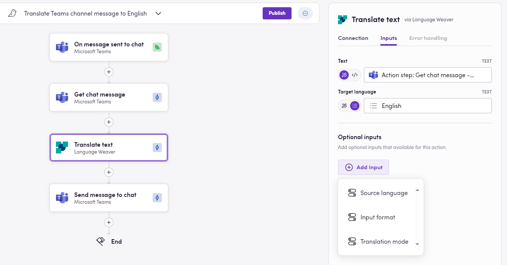

# Blackbird.io Language Weaver

Blackbird is the new automation backbone for the language technology industry. Blackbird provides enterprise-scale automation and orchestration with a simple no-code/low-code platform. Blackbird enables ambitious organizations to identify, vet and automate as many processes as possible. Not just localization workflows, but any business and IT process. This repository represents an application that is deployable on Blackbird and usable inside the workflow editor.

## Introduction

<!-- begin docs -->

Language Weaver is the machine translation technology and brand of RWS. It is a secure, adaptable, cloud-based enterprise machine translation API and portal for businesses that need to process high volumes of multilingual content quickly and effectively.

## Before setting up

Before you can connect you need to make sure that:

- You have a Language Weaver account with admin credentials.
- You have set up API Credentials in your [Language Weaver portal](https://portal.languageweaver.com/settings/api-credentials). When creating new credentials be sure to save the Client secret.

## Connecting

1. Navigate to apps and search for Language Weaver. If you cannot find Language Weaver then click _Add App_ in the top right corner, select Language Weaver and add the app to your Blackbird environment.
2. Click _Add Connection_.
3. Name your connection for future reference e.g. 'My Language Weaver'.
4. Fill in your Client ID and Client secret that you copied from the [Language Weaver portal](https://portal.languageweaver.com/settings/api-credentials)
5. Click _Connect_.

## Actions

### Translation

- **Translate text** translates a text input.
- **Translate file** translates a file input. Supported file formats can be found [here](https://developers.languageweaver.com/api/lw/common/input-formats.html).

All translation endpoints can have a mode of either "quality" or "speed".

- **Translate text with QE**.
- **Translate file with QE** both apply a quality estimation to the translated content. Source language is required and cannot be guessed. These actions have limited language combinations available and you should check available models in your Language Weaver account for supported language combinations.

Quality estimation and ABBYY PDF conversion have to be enabled for your account in the Language Weaver settings.

### Identification

- **Identify text language** identifies the language of a text input.
- **Identify file language** identifies the language of a file input.

### Content insights

- **Get file content insights** creates and immediately returns content insights for a file, this includes word/character counts, source language and a score per segment.

### Dictionary management

- **Get dictionary** returns information about a dictionary.
- **Create dictionary**.
- **Delete dictionary**.
- **Import glossary** allows for the import of a glossary into an existing or new dictionary. For new dictionaries, specify source and target languages, with optional title and description. When importing into an existing dictionary, use the optional _Dictionary ID_ parameter. The _Overwrite duplicate terms_ option allows control over updating existing values when importing. If the imported glossary lacks specified languages in the dictionary, the most relevant alternatives are chosen. For instance, if the dictionary includes _English_, but the glossary only has _English (United States)_, the latter's terms are incorporated into the dictionary.

## Examples

This basic example shows how you can use Language Weaver to translate Microsoft Teams messages.

Here, whenever PDF files are uploaded to SharePoint Documents, each file is downloaded, translated with Language Weaver and placed in the appropriate directory based on the translation quality assessment. 

## Missing features

In the future we can support and add actions for:

- Dictionary updates
- Dictionary term management
- Brand management
- Labels management
- Group management
- Feedback management
- Adaption

Let us know if you're interested!

## Feedback

Feedback to our implementation of Language Weaver is always very welcome. Reach out to us using the [established channels](https://www.blackbird.io/) or create an issue.

<!-- end docs -->
